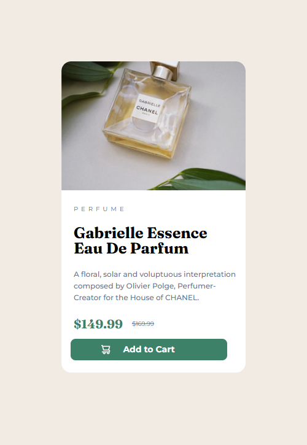

# Frontend Mentor - Product preview card component solution

This is a solution to the [Product preview card component challenge on Frontend Mentor](https://www.frontendmentor.io/challenges/product-preview-card-component-GO7UmttRfa). Frontend Mentor challenges help you improve your coding skills by building realistic projects.

## Table of contents

- [Overview](#overview)
  - [The challenge](#the-challenge)
  - [Screenshot](#screenshot)
- [My process](#my-process)

  - [Built with](#built-with)
  - [What I learned](#what-i-learned)

  - [Useful resources](#useful-resources)

- [Author](#author)
- [Acknowledgments](#acknowledgments)

## Overview

### The challenge

Users should be able to:

- View the optimal layout depending on their device's screen size
- See hover and focus states for interactive elements

### Screenshot




## My process

### Built with

- Semantic HTML5 markup
- Mobile-first workflow
- SASS

### What I learned

I have learned _SASS/SCSS_, a CSS preprocessor and how it helps maintain large styles sheets by implementing variables and nesting of rules.

```scss
$Montserrat: "Montserrat", sans-serif;
$Fraunces: "Fraunces", sans-serif;

.product-name {
  font-family: $Fraunces;
  font-size: 32px;
  line-height: 100%;
  letter-spacing: 0px;
  font-weight: bold;
  padding: 10px;

  @media screen and (max-width: $mobile-screen) {
    margin-left: 10px;
    width: 80%;
    font-size: 25px;
  }
}
```

### Useful resources

- [W3 Schools](https://www.w3schools.com/sass/) - This helped me learn and implement SASS. I really liked this pattern and will use it going forward. I'd recommend it to anyone still learning this concept.

## Author

- Megha Pai
- Frontend Mentor - [@meghapai](https://www.frontendmentor.io/profile/meghapai)

## Acknowledgments

I would like to thank W3schools for their invaluable resources which helped me learn SASS and complete this challenge

**BONUS**

I have also added CSS file
